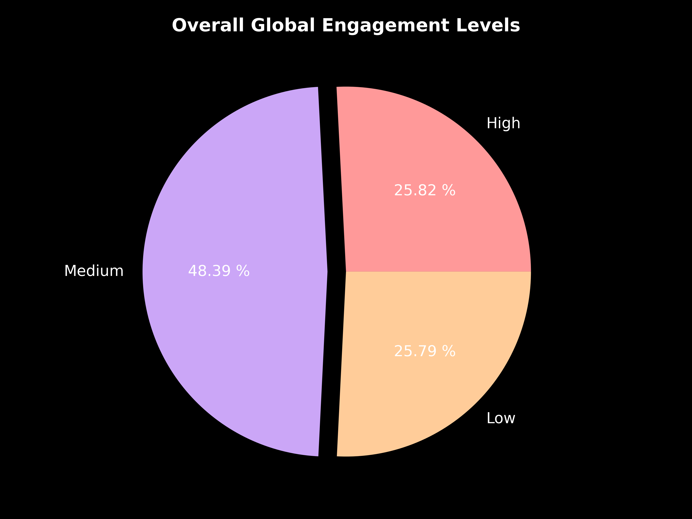
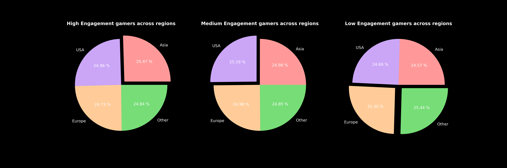
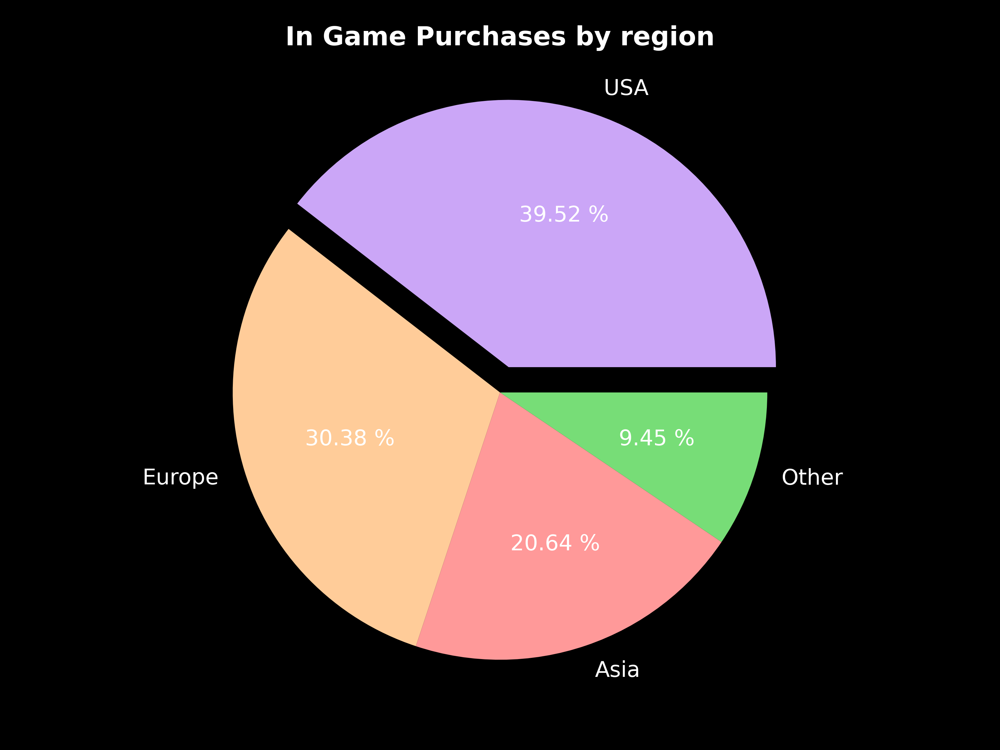
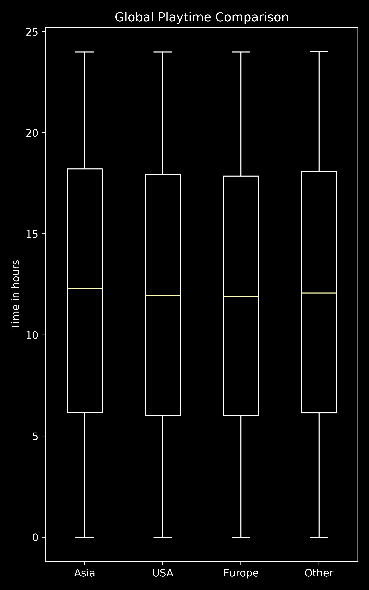

# **Global Online Gaming Behaviour Analysis**

   

##### Exploring player engagement, preferences, and trends through data.

---

## **🎮 About This Project**

This project was created to practice **data analysis** and **visualization** skills learned on the journey to mastering **machine learning**. Using Python and libraries such as **NumPy**, **Pandas**, and **Matplotlib**, we dived deep into global gaming behaviour to uncover trends and insights. 

To make this project more engaging, we aim to prove the hypothesis:

### **"High engagement correlates with increased in-game spending."**

Through detailed data analysis and visuals, we'll explore whether players who spend more time gaming also tend to spend more money on in-game purchases. This hypothesis is critical as it highlights the potential revenue opportunities for game developers targeting specific audiences.

---

## **📚 Dataset Details**

**Source:** [Kaggle](https://www.kaggle.com/datasets/rabieelkharoua/predict-online-gaming-behavior-dataset)

**Metrics Explored:** PlayTimeHours, InGamePurchases, GameDifficulty, EngagementLevel

**Regions Covered:** Asia, USA, Europe, and Other regions

---

## **🚀 Insights & Visuals**

### **🌟 Global Engagement Levels**

  

**Takeaway:**
- The majority of gamers fall into the medium to high engagement categories.
- High engagement correlates with higher playtime and sessions.

### **🌍 Engagement by Region**

  

**Takeaway:**
- Asia and the USA lead in high engagement, making them prime markets for immersive games.

### **🛒 In-Game Purchases by Region**

  

**Takeaway:**
- The USA dominates in-game spending, showcasing a significant market for digital transactions.

### **⏱️ Global Playtime**

  

**Takeaway:**
- Asia has the highest average playtime, indicating a deeply engaged gaming culture.

---

## **📊 Hypothesis Validation**

Using data correlations, we investigated the relationship between **engagement levels** and **in-game purchases**:

- Players with "High Engagement" were found to contribute significantly more to in-game spending, validating our hypothesis.
- This correlation was most evident in the USA and Europe, emphasizing the potential profitability of targeting highly engaged audiences in these regions.

### **Implications for Game Developers:**
- **Focus on Engagement:** Strategies to boost playtime and sessions can directly enhance revenue through in-game purchases.
- **Regional Targeting:** Tailored content and marketing in the USA and Europe can maximize returns.

---

## **🌟 Why It Matters**

- **Data Analysis in ML:** Data analysis is foundational to machine learning. Understanding trends and insights ensures better model performance and interpretability.
- **Visualization Skills:** Clear and impactful visuals make complex data understandable, an essential skill for ML practitioners.
- **Proving Hypotheses:** Validating hypotheses through real-world data bridges the gap between theory and practical application.

---

This project was created by:

| Name                      | Institution             | ID | GitHub | Followers |
|---------------------------|-------------------------|--  |--------|------|
| **Rajin Khan**            | North South University | 2212708042 |  |  |

---

###### Thank you for exploring this project and helping validate our hypothesis!

