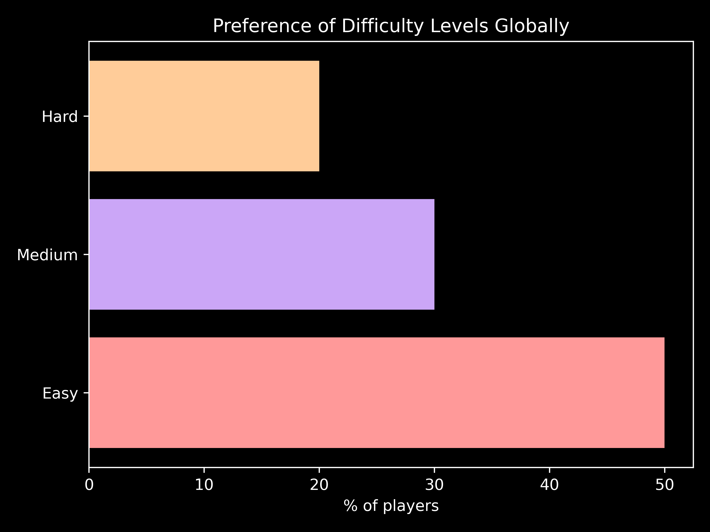

# **Global Online Gaming Behaviour Analysis**

   

##### Exploring player engagement, preferences, and trends through data.

---

## **🎮 About This Project**

This project was created to practice **data analysis** and **visualization** skills learned on the journey to mastering **machine learning**. Using Python and libraries such as **NumPy**, **Pandas**, and **Matplotlib**, we dived deep into global gaming behaviour to uncover trends and insights. 

This experience was not only fun but also an invaluable lesson in understanding data, which forms the backbone of machine learning.

---

## **📚 Dataset Details**

**Source:** [Kaggle](https://www.kaggle.com/datasets/rabieelkharoua/predict-online-gaming-behavior-dataset)

**Metrics Explored:** PlayTimeHours, InGamePurchases, GameDifficulty, EngagementLevel

**Regions Covered:** Asia, USA, Europe, and Other regions

---

## **🚀 Insights & Visuals**

### **🌟 Global Engagement Levels**

  

**Takeaway:**
- The majority of gamers fall into the medium to high engagement categories.
- High engagement correlates with higher playtime and sessions.

### **🌍 Engagement by Region**

  

**Takeaway:**
- Asia and the USA lead in high engagement, making them prime markets for immersive games.

### **🎮 Preferred Difficulty Levels**

  

**Takeaway:**
- Globally, most players prefer easy to medium difficulty games, aligning with gaming as a recreational activity.

### **🛒 In-Game Purchases by Region**

  

**Takeaway:**
- The USA dominates in-game spending, showcasing a significant market for digital transactions.

### **⏱️ Global Playtime**

  

**Takeaway:**
- Asia has the highest average playtime, indicating a deeply engaged gaming culture.

---

## **🌟 Why It Matters**

- **Data Analysis in ML:** Data analysis is foundational to machine learning. Understanding trends and insights ensures better model performance and interpretability.
- **Visualization Skills:** Clear and impactful visuals make complex data understandable, an essential skill for ML practitioners.
- **Fun with Learning:** Exploring real-world data makes the learning process exciting and memorable.

---

## **📊 Project Goals**

- Enhance data analysis and visualization skills.
- Build a deeper understanding of global gaming behaviour.
- Practice translating raw data into actionable insights.
- Create visually appealing and informative charts to share findings.

---

This project was created by:

| Name                      | Institution             | ID | GitHub | Followers |
|---------------------------|-------------------------|--  |--------|------|
| **Rajin Khan**            | North South University | 2212708042 |  |  |

---

###### Thank you for exploring this project!

